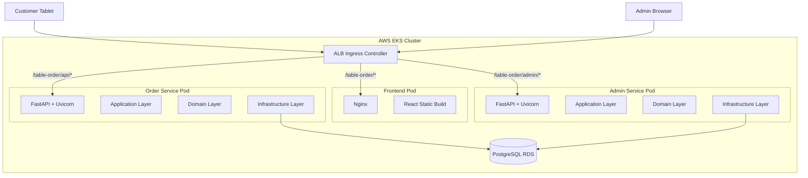
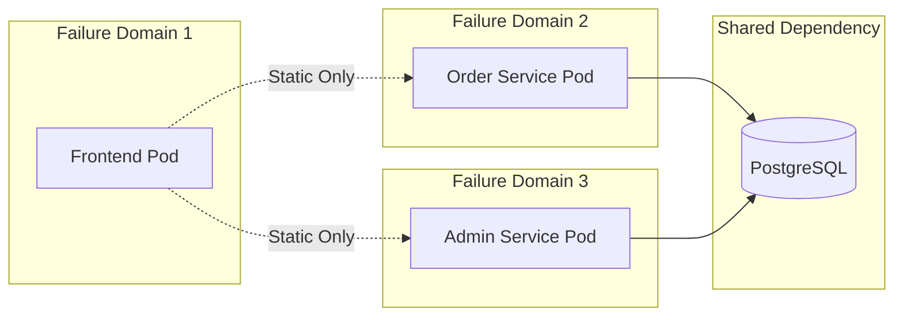
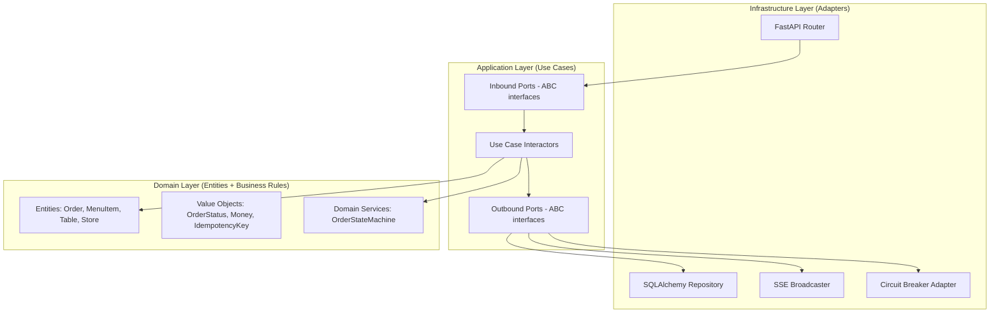
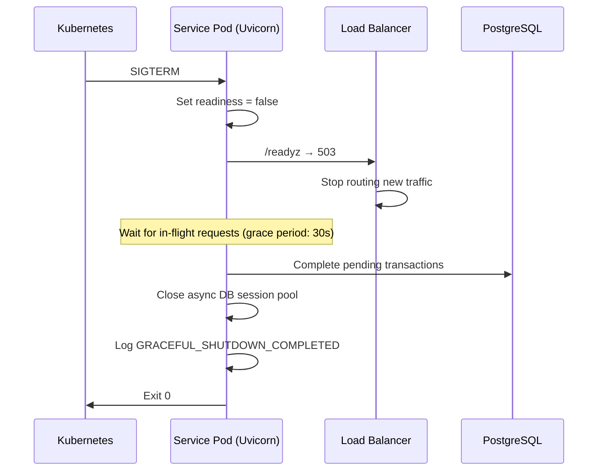
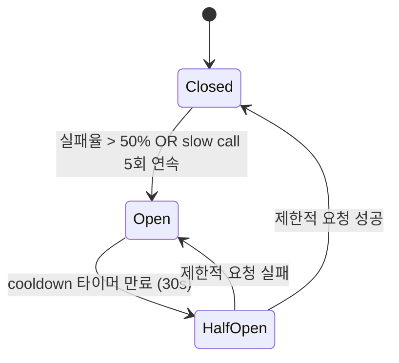
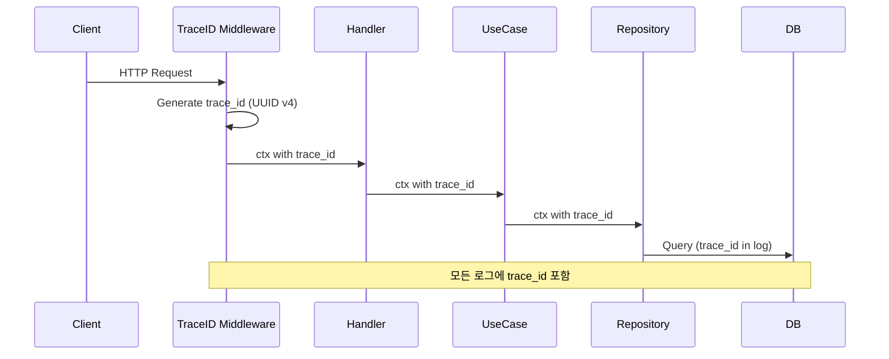
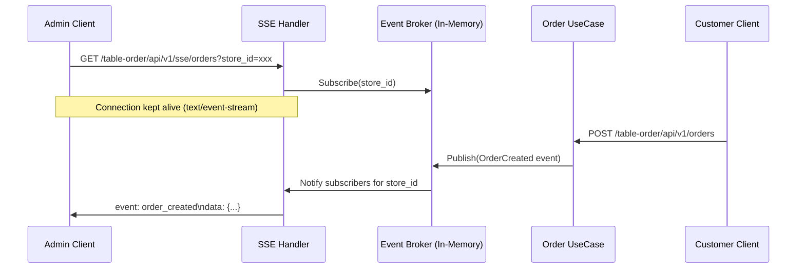
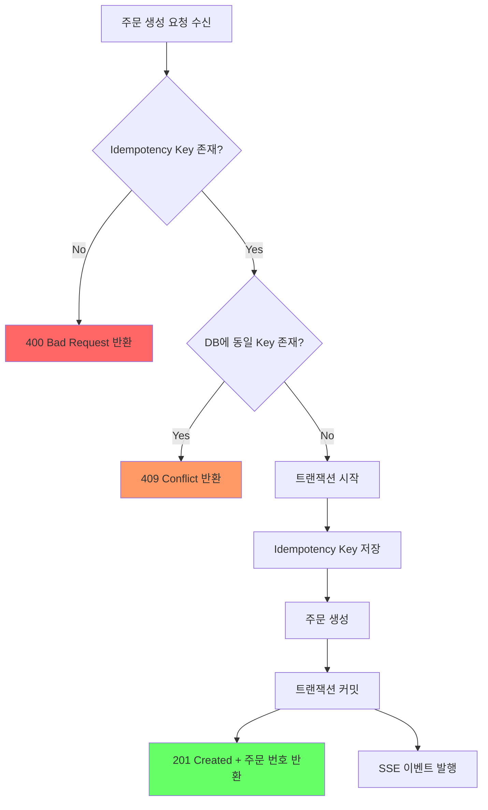
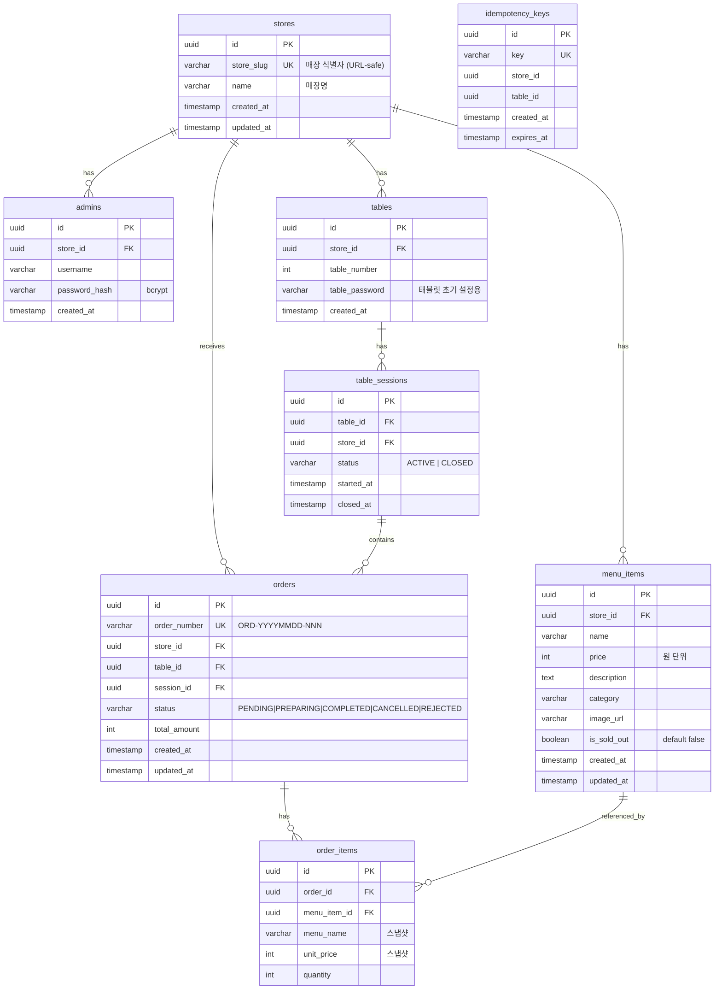
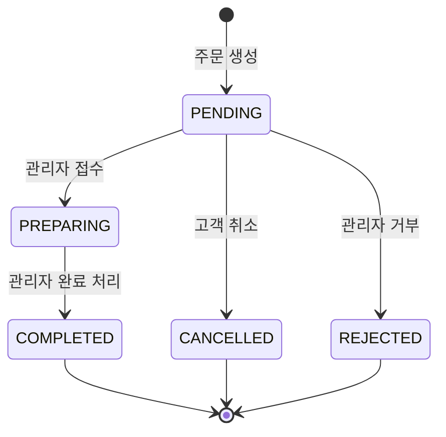

# Design Document: Table Order Service

## Overview

테이블오더 서비스는 3-Pod MSA 구조로 설계된 웹 기반 주문 플랫폼이다. 고객은 태블릿을 통해 메뉴 조회 및 주문을 수행하고, 매장 관리자는 실시간 주문 모니터링과 매장 운영을 관리한다.

핵심 설계 목표:
- **장애 격리**: Pod 간 독립적 장애 경계를 형성하여 단일 서비스 장애가 전체 시스템으로 전파되지 않도록 한다
- **무중단 배포**: Graceful Shutdown + Health Check 기반으로 배포 시 트래픽 유실을 방지한다
- **추적 가능성**: Structured JSON Logging + trace_id 전파로 장애 원인을 신속히 파악한다
- **데이터 정합성**: Idempotency Key + 트랜잭션 기반으로 중복 주문과 데이터 불일치를 방지한다

### 기술 스택

| 구분 | 기술 | 선택 근거 |
|------|------|-----------|
| Backend | Python (FastAPI) | 비동기 처리(asyncio), 자동 OpenAPI 문서, Pydantic 검증, 빠른 개발 속도 |
| Frontend | React (Vite) + Nginx | SPA 정적 빌드, CDN 친화적, Nginx Pod 서빙 |
| Database | PostgreSQL (RDS) | ACID 트랜잭션, Idempotency Key UNIQUE 제약, Read Replica 확장 |
| ORM | SQLAlchemy 2.0 + asyncpg | 비동기 DB 접근, 타입 안전 쿼리, 마이그레이션(Alembic) |
| 실시간 | SSE (Server-Sent Events) | 단방향 푸시, HTTP 기반 단순성, 재연결 내장 |
| 인증 | JWT (16시간) | Stateless, 수평 확장 친화적 |
| 컨테이너 | Docker + EKS | 독립 스케일링, 장애 격리 |

## Architecture

### 배포 아키텍처 (3-Pod MSA)



### 라우팅 규칙

| Path Pattern | Target Pod | 용도 |
|---|---|---|
| `/table-order/` | Frontend Pod | React SPA 정적 파일 |
| `/table-order/api/v1/*` | Order Service Pod | 고객 주문 API |
| `/table-order/admin/api/v1/*` | Admin Service Pod | 관리자 API |
| `/table-order/api/v1/sse/*` | Order Service Pod | SSE 실시간 스트림 |

### 장애 격리 경계



**격리 원칙:**
- Order Service 장애 시: 고객 주문 불가, 관리자 기능 정상 동작
- Admin Service 장애 시: 관리 기능 불가, 고객 주문 정상 동작
- Frontend Pod 장애 시: UI 불가, API 직접 호출은 정상
- DB 장애 시: 양쪽 서비스 모두 Graceful Degradation (Health Check → Readiness false)

## Components and Interfaces

### Hexagonal Architecture (각 서비스 공통 구조)



### Order Service Pod — 디렉토리 구조

```
backend/order-service/
├── app/
│   ├── main.py                  # FastAPI 앱 생성, 라우터 등록, lifespan (Graceful Shutdown)
│   ├── config.py                # 환경 변수 로딩 (pydantic-settings)
│   ├── domain/
│   │   ├── entities/
│   │   │   ├── order.py         # Order 엔티티
│   │   │   ├── menu_item.py     # MenuItem 엔티티
│   │   │   └── table_session.py # TableSession 엔티티
│   │   ├── value_objects/
│   │   │   ├── order_status.py  # OrderStatus 값 객체 + 상태 전이 규칙
│   │   │   └── money.py         # Money 값 객체
│   │   └── services/
│   │       └── order_state_machine.py
│   ├── application/
│   │   ├── ports/
│   │   │   ├── inbound.py       # UseCase ABC 인터페이스
│   │   │   └── outbound.py      # Repository, EventPublisher ABC 인터페이스
│   │   └── use_cases/
│   │       ├── create_order.py
│   │       ├── get_menu.py
│   │       ├── get_orders.py
│   │       └── cancel_order.py
│   └── infrastructure/
│       ├── routers/
│       │   ├── menu_router.py
│       │   ├── order_router.py
│       │   └── sse_router.py
│       ├── repositories/
│       │   ├── sqlalchemy_order_repo.py
│       │   ├── sqlalchemy_menu_repo.py
│       │   └── sqlalchemy_session_repo.py
│       ├── middleware/
│       │   ├── trace_id.py
│       │   ├── request_logger.py
│       │   └── error_handler.py
│       ├── sse/
│       │   └── broker.py        # In-Memory Event Broker (asyncio)
│       ├── database.py          # SQLAlchemy async engine + session
│       └── models.py            # SQLAlchemy ORM 모델
├── tests/
│   ├── unit/
│   ├── integration/
│   └── property/
├── alembic/                     # DB 마이그레이션
├── alembic.ini
├── Dockerfile
├── pyproject.toml
└── requirements.txt
```

### Admin Service Pod — 디렉토리 구조

```
backend/admin-service/
├── app/
│   ├── main.py                  # FastAPI 앱 생성, 라우터 등록, lifespan
│   ├── config.py                # 환경 변수 로딩 (pydantic-settings)
│   ├── domain/
│   │   ├── entities/
│   │   │   ├── store.py
│   │   │   ├── admin.py
│   │   │   └── table.py
│   │   └── value_objects/
│   │       └── credentials.py
│   ├── application/
│   │   ├── ports/
│   │   │   ├── inbound.py
│   │   │   └── outbound.py
│   │   └── use_cases/
│   │       ├── register_store.py
│   │       ├── authenticate.py
│   │       ├── manage_menu.py
│   │       ├── manage_order_status.py
│   │       ├── manage_session.py
│   │       └── monitor_orders.py
│   └── infrastructure/
│       ├── routers/
│       │   ├── auth_router.py
│       │   ├── store_router.py
│       │   ├── menu_router.py
│       │   ├── order_router.py
│       │   └── session_router.py
│       ├── repositories/
│       │   ├── sqlalchemy_store_repo.py
│       │   ├── sqlalchemy_admin_repo.py
│       │   ├── sqlalchemy_menu_repo.py
│       │   ├── sqlalchemy_order_repo.py
│       │   └── sqlalchemy_session_repo.py
│       ├── middleware/
│       │   ├── jwt_auth.py
│       │   ├── trace_id.py
│       │   └── request_logger.py
│       ├── database.py
│       └── models.py
├── tests/
│   ├── unit/
│   ├── integration/
│   └── property/
├── alembic/
├── alembic.ini
├── Dockerfile
├── pyproject.toml
└── requirements.txt
```

### 핵심 인터페이스 (Ports)

#### Order Service — Inbound Ports

```python
# app/application/ports/inbound.py
from abc import ABC, abstractmethod
from typing import Optional

class MenuQueryUseCase(ABC):
    @abstractmethod
    async def get_menus_by_store(self, store_id: str) -> list[dict]:
        ...

    @abstractmethod
    async def get_menu_detail(self, menu_id: str) -> Optional[dict]:
        ...

class OrderCreateUseCase(ABC):
    @abstractmethod
    async def create_order(self, request: "CreateOrderRequest") -> "CreateOrderResponse":
        ...

class OrderQueryUseCase(ABC):
    @abstractmethod
    async def get_orders_by_session(self, session_id: str) -> list[dict]:
        ...

class OrderCancelUseCase(ABC):
    @abstractmethod
    async def cancel_order(self, order_id: str, table_id: str) -> None:
        ...
```

#### Order Service — Outbound Ports

```python
# app/application/ports/outbound.py
from abc import ABC, abstractmethod
from typing import Optional

class OrderRepository(ABC):
    @abstractmethod
    async def save(self, order: "Order") -> None:
        ...

    @abstractmethod
    async def find_by_id(self, order_id: str) -> Optional["Order"]:
        ...

    @abstractmethod
    async def find_by_session_id(self, session_id: str) -> list["Order"]:
        ...

    @abstractmethod
    async def delete(self, order_id: str) -> None:
        ...

class MenuRepository(ABC):
    @abstractmethod
    async def find_by_store_id(self, store_id: str) -> list["MenuItem"]:
        ...

    @abstractmethod
    async def find_by_id(self, menu_id: str) -> Optional["MenuItem"]:
        ...

    @abstractmethod
    async def find_by_category(self, store_id: str, category: str) -> list["MenuItem"]:
        ...

class IdempotencyStore(ABC):
    @abstractmethod
    async def exists(self, key: str) -> bool:
        ...

    @abstractmethod
    async def save(self, key: str, ttl_seconds: int = 86400) -> None:
        ...

class SessionRepository(ABC):
    @abstractmethod
    async def find_active_by_table_id(self, table_id: str) -> Optional["TableSession"]:
        ...

    @abstractmethod
    async def create(self, session: "TableSession") -> None:
        ...

class OrderEventPublisher(ABC):
    @abstractmethod
    async def publish_order_created(self, order: "Order") -> None:
        ...

    @abstractmethod
    async def publish_order_status_changed(self, order: "Order") -> None:
        ...
```

#### Admin Service — Inbound Ports

```python
# app/application/ports/inbound.py
from abc import ABC, abstractmethod

class AuthUseCase(ABC):
    @abstractmethod
    async def login(self, request: "LoginRequest") -> "LoginResponse":
        ...

class StoreManagementUseCase(ABC):
    @abstractmethod
    async def register_store(self, request: "RegisterStoreRequest") -> "RegisterStoreResponse":
        ...

class MenuManagementUseCase(ABC):
    @abstractmethod
    async def create_menu(self, request: "CreateMenuRequest") -> dict:
        ...

    @abstractmethod
    async def update_menu(self, menu_id: str, request: "UpdateMenuRequest") -> dict:
        ...

    @abstractmethod
    async def delete_menu(self, menu_id: str) -> None:
        ...

    @abstractmethod
    async def set_sold_out(self, menu_id: str, sold_out: bool) -> None:
        ...

class OrderManagementUseCase(ABC):
    @abstractmethod
    async def update_order_status(self, order_id: str, new_status: str) -> None:
        ...

    @abstractmethod
    async def reject_order(self, order_id: str) -> None:
        ...

    @abstractmethod
    async def delete_order(self, order_id: str) -> None:
        ...

class SessionManagementUseCase(ABC):
    @abstractmethod
    async def close_session(self, table_id: str) -> None:
        ...

    @abstractmethod
    async def get_session_history(self, table_id: str) -> list[dict]:
        ...
```

### Resilience Components

#### Graceful Shutdown 시퀀스



#### Circuit Breaker 상태 전이



**Circuit Breaker 설정 (환경 변수):**
- `CIRCUIT_FAILURE_THRESHOLD=0.5` (50% 실패율)
- `CIRCUIT_SLOW_CALL_THRESHOLD_MS=3000` (3초 초과 = slow call)
- `CIRCUIT_SLOW_CALL_COUNT=5` (연속 5회)
- `CIRCUIT_COOLDOWN_MS=30000` (Open → HalfOpen 대기)
- `CIRCUIT_HALF_OPEN_MAX_CALLS=3` (HalfOpen 시 허용 요청 수)

#### Health Check 설계

```python
# app/infrastructure/routers/health_router.py
from fastapi import APIRouter, Depends
from sqlalchemy.ext.asyncio import AsyncSession

router = APIRouter()

@router.get("/table-order/api/v1/healthz")
async def liveness():
    """Liveness Probe — 프로세스 생존 여부만 확인"""
    return {"status": "alive"}

@router.get("/table-order/api/v1/readyz")
async def readiness(db: AsyncSession = Depends(get_db)):
    """Readiness Probe — DB 연결 + Graceful Shutdown 상태 확인"""
    if app_state.is_shutting_down:
        return JSONResponse(status_code=503, content={"status": "shutting_down"})
    try:
        await db.execute(text("SELECT 1"))
        return {"status": "ready"}
    except Exception as e:
        return JSONResponse(
            status_code=503,
            content={"status": "db_unavailable", "error": str(e)}
        )
```

#### Trace Context 전파



**로그 포맷 예시:**
```json
{
  "timestamp": "2025-01-15T10:30:00.123Z",
  "level": "INFO",
  "trace_id": "a1b2c3d4-e5f6-7890-abcd-ef1234567890",
  "component": "order-service",
  "event": "ORDER_CREATED",
  "message": "Order created successfully",
  "context": {
    "order_id": "ORD-20250115-001",
    "store_id": "store-abc",
    "table_id": "table-5",
    "total_amount": 25000
  }
}
```

### SSE (Server-Sent Events) 설계



**SSE 설계 결정:**
- In-Memory Event Broker: 단일 Pod 내에서 goroutine 기반 pub/sub
- 매장별 채널 분리: `store_id` 기준으로 구독 채널 격리
- 재연결 지원: `Last-Event-ID` 헤더로 누락 이벤트 재전송
- Heartbeat: 30초 간격 ping으로 연결 유지
- 타임아웃: 클라이언트 미응답 시 60초 후 연결 종료

**이벤트 타입:**
| Event Type | Trigger | Payload |
|---|---|---|
| `order_created` | 신규 주문 생성 | 주문 전체 정보 |
| `order_status_changed` | 상태 변경 | order_id, old_status, new_status |
| `order_cancelled` | 고객 취소 | order_id, table_id |
| `order_rejected` | 관리자 거부 | order_id, table_id |
| `order_deleted` | 관리자 삭제 | order_id, table_id |
| `heartbeat` | 30초 간격 | timestamp |

### Idempotency Key 처리 흐름



**Idempotency Key 설계:**
- 클라이언트가 UUID v4로 생성
- DB `idempotency_keys` 테이블에 UNIQUE 제약으로 저장
- TTL: 24시간 (배치로 만료 키 정리)
- 주문 생성과 동일 트랜잭션 내에서 저장 (원자성 보장)

## Data Models

### ERD (Entity-Relationship Diagram)



### 주문 상태 전이 (Domain Layer)



**허용된 상태 전이 규칙 (Domain Service):**

```python
# app/domain/value_objects/order_status.py
from enum import Enum

class OrderStatus(str, Enum):
    PENDING = "PENDING"
    PREPARING = "PREPARING"
    COMPLETED = "COMPLETED"
    CANCELLED = "CANCELLED"
    REJECTED = "REJECTED"

VALID_TRANSITIONS: dict[OrderStatus, list[OrderStatus]] = {
    OrderStatus.PENDING: [OrderStatus.PREPARING, OrderStatus.CANCELLED, OrderStatus.REJECTED],
    OrderStatus.PREPARING: [OrderStatus.COMPLETED],
}

def can_transition_to(current: OrderStatus, target: OrderStatus) -> bool:
    allowed = VALID_TRANSITIONS.get(current, [])
    return target in allowed
```

### API 엔드포인트 설계

#### Order Service (Port 8081)

| Method | Path | 설명 |
|--------|------|------|
| GET | `/table-order/api/v1/stores/:store_id/menus` | 카테고리별 메뉴 조회 |
| GET | `/table-order/api/v1/menus/:menu_id` | 메뉴 상세 조회 |
| POST | `/table-order/api/v1/orders` | 주문 생성 (Idempotency Key 필수) |
| GET | `/table-order/api/v1/sessions/:session_id/orders` | 세션별 주문 내역 조회 |
| PATCH | `/table-order/api/v1/orders/:order_id/cancel` | 고객 주문 취소 |
| GET | `/table-order/api/v1/sse/orders` | SSE 주문 스트림 |
| GET | `/table-order/api/v1/healthz` | Liveness Probe |
| GET | `/table-order/api/v1/readyz` | Readiness Probe |

#### Admin Service (Port 8082)

| Method | Path | 설명 |
|--------|------|------|
| POST | `/table-order/admin/api/v1/stores` | 매장 등록 |
| POST | `/table-order/admin/api/v1/auth/login` | 관리자 로그인 |
| GET | `/table-order/admin/api/v1/orders` | 주문 목록 조회 |
| PATCH | `/table-order/admin/api/v1/orders/:order_id/status` | 주문 상태 변경 |
| PATCH | `/table-order/admin/api/v1/orders/:order_id/reject` | 주문 거부 |
| DELETE | `/table-order/admin/api/v1/orders/:order_id` | 주문 삭제 |
| POST | `/table-order/admin/api/v1/menus` | 메뉴 등록 |
| PUT | `/table-order/admin/api/v1/menus/:menu_id` | 메뉴 수정 |
| DELETE | `/table-order/admin/api/v1/menus/:menu_id` | 메뉴 삭제 |
| PATCH | `/table-order/admin/api/v1/menus/:menu_id/sold-out` | 품절 설정/해제 |
| POST | `/table-order/admin/api/v1/sessions/:table_id/close` | 테이블 세션 종료 |
| GET | `/table-order/admin/api/v1/sessions/:table_id/history` | 과거 세션 조회 |
| GET | `/table-order/admin/api/v1/healthz` | Liveness Probe |
| GET | `/table-order/admin/api/v1/readyz` | Readiness Probe |

## Correctness Properties

*A property is a characteristic or behavior that should hold true across all valid executions of a system — essentially, a formal statement about what the system should do. Properties serve as the bridge between human-readable specifications and machine-verifiable correctness guarantees.*

### Property 1: Order State Machine Integrity

*For any* order in any valid state, only transitions defined in the `validTransitions` map shall succeed; all other transition attempts shall be rejected with a 400 error. Specifically:
- PENDING → {PREPARING, CANCELLED, REJECTED} are the only valid transitions from PENDING
- PREPARING → {COMPLETED} is the only valid transition from PREPARING
- COMPLETED, CANCELLED, REJECTED are terminal states with no valid outgoing transitions

**Validates: Requirements 8.1, 8.2, 13.1, 13.2, 13.3**

### Property 2: Idempotency Key Prevents Duplicate Orders

*For any* valid order creation request, submitting the same request twice with the same Idempotency Key shall result in exactly one order being created. The second request shall return 409 Conflict without creating a duplicate order.

**Validates: Requirements 3.4, 3.5**

### Property 3: Order Creation Invariant

*For any* valid order creation request (non-empty menu list, valid store/table/session, all menus available), the system shall create an order with status PENDING and return a unique order number. The persisted order shall contain all submitted menu items with correct quantities and prices.

**Validates: Requirements 3.1, 3.6**

### Property 4: Session Isolation

*For any* table with multiple sessions (past closed sessions and one active session), querying orders for the active session shall return only orders belonging to that session. Orders from closed sessions shall never appear in the active session query results.

**Validates: Requirements 4.1, 4.3**

### Property 5: Session Closure Resets Table State

*For any* active session with orders, closing the session shall: (1) mark the session as CLOSED, (2) move all orders to historical records, and (3) reset the table's current order total to 0. After closure, a new session can be started on the same table.

**Validates: Requirements 9.2, 9.3**

### Property 6: Cart Total Calculation

*For any* cart containing menu items with quantities, the displayed total shall equal the sum of (unit_price × quantity) for all items in the cart. This invariant holds after any sequence of add, remove, increment, or decrement operations.

**Validates: Requirements 2.1, 2.2**

### Property 7: Cart Persistence Round-Trip

*For any* cart state, serializing to localStorage and then deserializing shall produce an identical cart (same items, quantities, and computed total).

**Validates: Requirements 2.3**

### Property 8: Order Total Recalculation on Removal

*For any* table with multiple orders, when an order is deleted, cancelled, or rejected, the table's total order amount shall equal the sum of amounts of all remaining active orders (PENDING + PREPARING + COMPLETED).

**Validates: Requirements 10.1, 13.4**

### Property 9: Menu Category Filtering

*For any* store with menus across multiple categories, querying by a specific category shall return only menus belonging to that category, and querying all menus shall return them grouped by category with no items missing.

**Validates: Requirements 1.1, 11.6**

### Property 10: Menu Validation Rejects Invalid Input

*For any* menu creation or update request missing required fields (name, price, category) or with price ≤ 0, the system shall return 400 and not persist the invalid menu.

**Validates: Requirements 11.4, 11.5**

### Property 11: Sold-Out Round-Trip

*For any* menu item, setting sold-out then unsetting sold-out shall restore the menu to orderable state. While sold-out, any order containing that menu shall be rejected with 400.

**Validates: Requirements 14.1, 14.2, 14.3, 14.4**

### Property 12: JWT Token Lifecycle

*For any* valid admin credentials, authentication shall produce a JWT with exactly 16-hour expiry. Any API request with an expired JWT shall be rejected with 401. The token shall contain the correct store_id and admin_id claims.

**Validates: Requirements 6.1, 6.2, 6.4**

### Property 13: Password Hashing Invariant

*For any* admin password stored in the system, the stored value shall be a valid bcrypt hash (never plaintext). Verifying the original password against the stored hash shall succeed; verifying any other password shall fail.

**Validates: Requirements 6.5**

### Property 14: Store Identifier Uniqueness

*For any* store registration, attempting to register a second store with the same store_slug shall fail with 409 Conflict. The original store shall remain unchanged.

**Validates: Requirements 12.2**

### Property 15: Order Response Completeness

*For any* order returned by the system, the response shall include: order_number, created_at, menu items with quantities, total_amount, and current status. No required field shall be null or missing.

**Validates: Requirements 4.2**

### Property 16: Auto-Session Creation on First Order

*For any* table without an active session, creating the first order shall automatically create a new active session and associate the order with it.

**Validates: Requirements 9.1**

## Error Handling

### 에러 응답 표준 포맷

```json
{
  "error": {
    "code": "ORDER_DUPLICATE_IDEMPOTENCY_KEY",
    "message": "동일한 Idempotency Key로 이미 주문이 생성되었습니다",
    "details": {
      "idempotency_key": "uuid-value",
      "existing_order_id": "ORD-20250115-001"
    }
  },
  "trace_id": "a1b2c3d4-e5f6-7890-abcd-ef1234567890"
}
```

### 에러 코드 체계

| HTTP Status | Error Code | 설명 | 대응 |
|---|---|---|---|
| 400 | `VALIDATION_ERROR` | 필수 필드 누락, 타입 불일치 | 클라이언트 입력 수정 |
| 400 | `INVALID_STATE_TRANSITION` | 허용되지 않는 상태 전이 | 현재 상태 확인 후 재시도 |
| 400 | `SOLD_OUT_MENU_INCLUDED` | 품절 메뉴 포함 주문 | 품절 메뉴 제거 후 재주문 |
| 400 | `MISSING_IDEMPOTENCY_KEY` | Idempotency Key 미포함 | Key 생성 후 재요청 |
| 401 | `UNAUTHORIZED` | 인증 실패 또는 토큰 만료 | 재로그인 |
| 404 | `STORE_NOT_FOUND` | 존재하지 않는 매장 | 매장 ID 확인 |
| 404 | `ORDER_NOT_FOUND` | 존재하지 않는 주문 | 주문 ID 확인 |
| 404 | `MENU_NOT_FOUND` | 존재하지 않는 메뉴 | 메뉴 ID 확인 |
| 409 | `DUPLICATE_IDEMPOTENCY_KEY` | 중복 Idempotency Key | 새 Key로 재요청 불필요 (이미 처리됨) |
| 409 | `STORE_SLUG_CONFLICT` | 매장 식별자 중복 | 다른 식별자 사용 |
| 500 | `INTERNAL_ERROR` | 서버 내부 오류 | 재시도 또는 관리자 문의 |
| 503 | `SERVICE_UNAVAILABLE` | Circuit Open 또는 DB 불가 | 잠시 후 재시도 |

### 장애 시나리오별 처리 전략

| 장애 시나리오 | 감지 방법 | 처리 전략 | 로그 이벤트 |
|---|---|---|---|
| DB Connection Timeout | 3초 timeout | Readiness false, 503 반환 | `DB_TIMEOUT` |
| DB Query Timeout | Context deadline exceeded | 에러 응답 + 로그 | `DB_QUERY_TIMEOUT` |
| 외부 API Timeout | Circuit Breaker | Circuit Open, Fail Fast | `CIRCUIT_OPEN` |
| 중복 주문 요청 | Idempotency Key 중복 | 409 반환, 주문 미생성 | `DUPLICATE_ORDER_BLOCKED` |
| 잘못된 상태 전이 | Domain 검증 | 400 반환 | `INVALID_STATE_TRANSITION` |
| JWT 만료 | 토큰 검증 미들웨어 | 401 반환 | `TOKEN_EXPIRED` |
| 환경 변수 누락 | 시작 시 검증 | 시작 중단 + 에러 로그 | `CONFIG_MISSING` |
| SIGTERM 수신 | Signal handler | Graceful Shutdown 시작 | `GRACEFUL_SHUTDOWN_STARTED` |
| Panic/Unhandled Error | Recovery 미들웨어 | 500 반환 + 스택 로그 | `UNHANDLED_PANIC` |

### 에러 전파 원칙

```
Handler → UseCase → Domain → Repository
   ↑         ↑         ↑         ↑
   |         |         |         |
 HTTP 변환  비즈니스   도메인     인프라
 (status)   에러 래핑  에러 생성  에러 생성
```

1. **Domain Layer**: 도메인 에러 타입 정의 (`ErrInvalidTransition`, `ErrSoldOutMenu`)
2. **Application Layer**: 도메인 에러를 비즈니스 컨텍스트로 래핑
3. **Infrastructure Layer**: 비즈니스 에러를 HTTP 상태 코드 + JSON 응답으로 변환
4. **원칙**: 내부 구현 정보(스택 트레이스, DB 구조)는 절대 클라이언트에 노출하지 않음

## Testing Strategy

### 테스트 피라미드

```
        ╱╲
       ╱  ╲        E2E Tests (수동/선택적)
      ╱────╲       - 전체 흐름 시나리오
     ╱      ╲
    ╱────────╲     Integration Tests
   ╱          ╲    - SSE 이벤트 전달
  ╱────────────╲   - DB Repository 동작
 ╱              ╲  - HTTP Handler 통합
╱────────────────╲ Unit Tests + Property Tests
                   - Domain 로직 (상태 전이, 검증)
                   - UseCase 로직 (비즈니스 규칙)
                   - Cart 계산 로직
```

### 테스트 분류

#### Property-Based Tests (Python: `hypothesis`)

각 Correctness Property에 대해 최소 100회 반복 실행하는 property-based test를 작성한다.

| Property | 테스트 대상 | 생성기 |
|---|---|---|
| Property 1 | OrderStatus.can_transition_to() | 모든 상태 쌍 조합 |
| Property 2 | CreateOrder with IdempotencyKey | 랜덤 UUID + 주문 데이터 |
| Property 3 | CreateOrder 결과 검증 | 랜덤 유효 주문 요청 |
| Property 6 | Cart.calculate_total() | 랜덤 아이템 + 수량 |
| Property 7 | Cart serialize/deserialize | 랜덤 카트 상태 |
| Property 8 | Table.recalculate_total() | 랜덤 주문 목록 + 삭제 대상 |
| Property 9 | MenuRepository.find_by_category() | 랜덤 메뉴 + 카테고리 |
| Property 10 | MenuValidation | 랜덤 무효 입력 (빈 이름, 음수 가격 등) |
| Property 11 | SoldOut toggle + order validation | 랜덤 메뉴 + 품절 토글 |
| Property 12 | JWT 생성 + 검증 | 랜덤 admin 정보 |
| Property 13 | bcrypt hash + verify | 랜덤 패스워드 문자열 |
| Property 14 | Store registration uniqueness | 랜덤 store_slug |

**PBT 라이브러리**: `hypothesis` (Python property-based testing)
- 최소 100회 반복 (`@settings(max_examples=100)`)
- 각 테스트에 Property 번호 태그: `# Feature: table-order-service, Property 1: Order State Machine Integrity`

#### Unit Tests (Example-Based)

| 테스트 대상 | 시나리오 | 검증 항목 |
|---|---|---|
| 주문 생성 | 유효한 주문 요청 | 201 + 주문 번호 반환 |
| 주문 생성 | Idempotency Key 없음 | 400 반환 |
| 메뉴 조회 | 존재하지 않는 매장 | 404 반환 |
| 로그인 | 잘못된 비밀번호 | 401 반환 |
| 메뉴 삭제 | 존재하는 메뉴 삭제 | 200 + 조회 불가 확인 |
| 세션 종료 | 확인 후 종료 | 세션 CLOSED + 주문 이력 이동 |

#### Edge Case Tests (필수 — NFR-9 준수)

| # | 시나리오 | 검증 항목 |
|---|---|---|
| 1 | 중복 Idempotency Key 요청 | 409 반환, 주문 1건만 존재 |
| 2 | 외부 API Timeout → Circuit Open | Circuit Open 로그, 503 반환 |
| 3 | DB Connection Timeout | Readiness false, 503 반환, `DB_TIMEOUT` 로그 |
| 4 | SIGTERM 수신 | Graceful Shutdown 로그, 진행 중 요청 완료 |
| 5 | 잘못된 입력값 (SQL Injection 시도) | 400 반환, 파라미터화 쿼리로 안전 처리 |
| 6 | 환경 변수 누락 | 시작 실패 + `CONFIG_MISSING` 로그 |
| 7 | 품절 메뉴 포함 주문 | 400 반환, 주문 미생성 |
| 8 | 만료된 JWT로 API 호출 | 401 반환 |
| 9 | PENDING이 아닌 주문 취소 시도 | 400 반환, 상태 불변 |
| 10 | 동시 주문 생성 (Race Condition) | 하나만 성공, 나머지 409 |

#### Integration Tests

| 테스트 대상 | 검증 항목 |
|---|---|
| SSE 주문 이벤트 전달 | 주문 생성 → 2초 이내 이벤트 수신 |
| SSE 상태 변경 이벤트 | 상태 변경 → 이벤트 수신 |
| PostgreSQL Repository | CRUD 동작 + 트랜잭션 롤백 |
| JWT 미들웨어 | 유효/무효/만료 토큰 처리 |
| Health Check | DB 정상/비정상 시 응답 |

### 테스트 환경 구성

- **DB**: Docker Compose로 PostgreSQL 컨테이너 실행 (테스트용)
- **외부 API**: Mock Payment 서비스 (`mock-payment/`)로 장애 시뮬레이션
- **SSE**: httpx 기반 SSE 클라이언트로 이벤트 수신 검증
- **로그 검증**: stdout capture → JSON 파싱 → 필드 검증
- **테스트 프레임워크**: pytest + pytest-asyncio + httpx (AsyncClient)

### Mock Payment 서비스 (장애 시뮬레이션)

```
mock-payment/
├── main.py
├── Dockerfile
└── README.md
```

**시뮬레이션 모드:**
- `MODE=success`: 항상 성공 응답 (200ms 지연)
- `MODE=timeout`: 항상 타임아웃 (5초 무응답)
- `MODE=intermittent`: 50% 확률로 실패
- `MODE=slow`: 3초 지연 후 성공 (Circuit Breaker 트리거)

이를 통해 Circuit Breaker 동작, Timeout 처리, Graceful Degradation을 실제로 검증한다.

